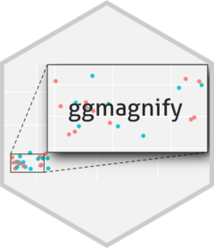
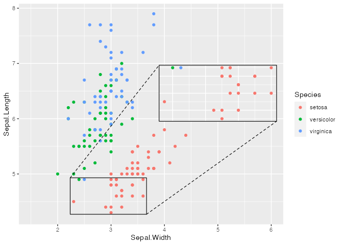
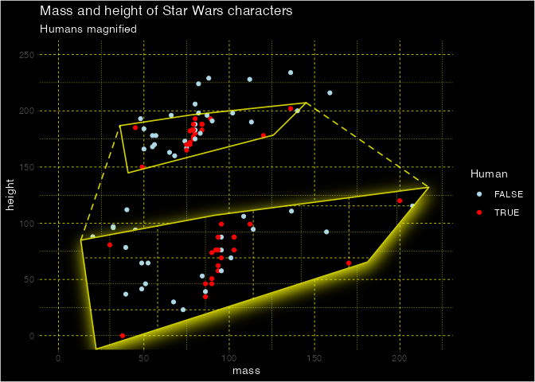
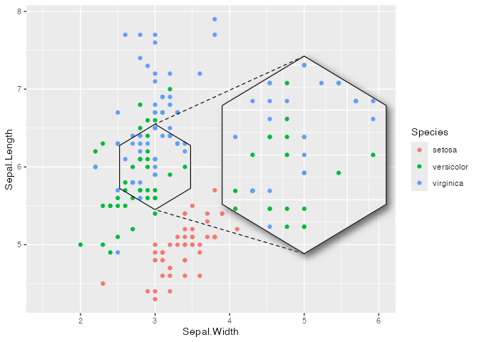
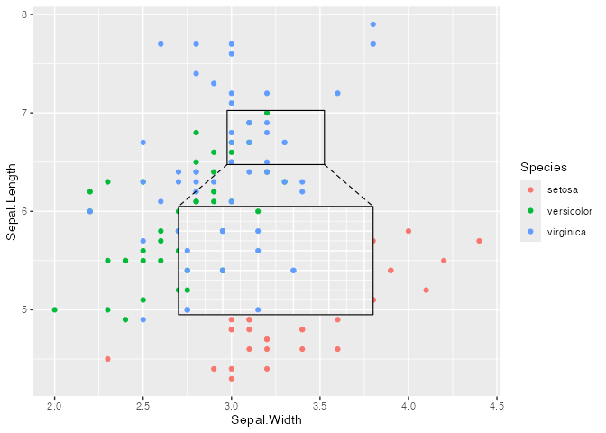
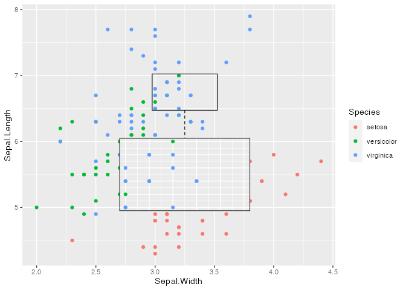

<!-- README.md is generated from README.Rmd. Please edit that file -->

# ggmagnify <a href="https://hughjonesd.github.io/ggmagnify/"></a>

<!-- badges: start -->

[](https://hughjonesd.r-universe.dev/ggmagnify)
[](https://github.com/hughjonesd/ggmagnify/actions/workflows/R-CMD-check.yaml)
[](https://lifecycle.r-lib.org/articles/stages.html#experimental)
<!-- badges: end -->

ggmagnify creates a magnified inset of part of a
[ggplot](https://ggplot2.tidyverse.org/) object. Borders can be drawn
around the target area and the inset, along with projection lines from
one to the other. The inset can have a drop shadow. The magnified area
can be a rectangle, an ellipse, a convex hull of points, or an arbitrary
shape.

You can install ggmagnify from r-universe:

``` r
install.packages("ggmagnify", repos = c("https://hughjonesd.r-universe.dev", 
                 "https://cloud.r-project.org"))
```

This will install the latest github release (currently 0.2.0).

Or install the development version from [GitHub](https://github.com/)
with:

``` r
# install.packages("remotes")
remotes::install_github("hughjonesd/ggmagnify")
```

## Basic inset

To create an inset, use `geom_magnify(from, to)`. `from` can be a vector
giving the four corners of the area to magnify:
`from = c(xmin, xmax, ymin, ymax)`.

Similarly, `to` specifies where the magnified inset should go:
`to = c(xmin, xmax, ymin, ymax)`.

``` r
library(ggplot2)
library(ggmagnify)

ggp <- ggplot(dv, aes(Position, NegLogP)) + 
  geom_point(color = "darkblue", alpha = 0.8, size = 0.8) +
  labs(title = "GWAS p-values for cognitive function",
       subtitle = "Davies et al. (2018).", y = "-log(p)")

from <- c(xmin = 9.75e7, xmax = 9.95e7, ymin = 16, ymax = 28)
# Names xmin, xmax, ymin, ymax are optional:
to <- c(2e8 - 2e7, 2e8 + 2e7,10, 26)

ggp + geom_magnify(from = from, to = to)
```


## Inset with shadow

``` r

loadNamespace("ggfx")
#> <environment: namespace:ggfx>

ggp + geom_magnify(from = from, to = to, 
                   shadow = TRUE)
```


## Rounded corners

New in version 0.3.0, use `corners` to give a proportional radius for
rounded corners.

``` r
ggp + geom_magnify(from = from, to = to, 
                   corners = 0.1, shadow = TRUE)
```


## Ellipse

This requires R 4.1 or higher, and an appropriate graphics device.

``` r

ggp + geom_magnify(from = from, to = to, 
                   shape = "ellipse", shadow = TRUE)
```


## Pick points to magnify

To choose points to magnify, map `from` in an `aes()`:

``` r
ggpi <- ggplot(iris, aes(Sepal.Width, Sepal.Length, colour = Species)) +
              geom_point() + xlim(c(1.5, 6))

ggpi + geom_magnify(aes(from = Species == "setosa" & Sepal.Length < 5), 
                    to = c(4, 6, 6, 7.5))
```



## Faceting

``` r

ggpi +
  facet_wrap(vars(Species)) +
  geom_magnify(aes(from = Sepal.Length > 5 & Sepal.Length < 6.5), 
                    to = c(4.5, 6, 6, 7.5),
                    shadow = TRUE)
```


## Magnify an arbitrary region (experimental)

Use `shape = "outline"` to magnify the convex hull of a set of points:

``` r

library(dplyr)

starwars_plot <- starwars |> 
  mutate(Human = species == "Human") |> 
  select(mass, height, Human) |> 
  na.omit() |> 
  ggplot(aes(mass, height, color = Human)) + 
    geom_point() + xlim(0, 220) + ylim(0, 250) + 
    theme_dark() +
    theme(panel.grid = element_line(linetype = 2, colour = "yellow"), 
          axis.line = element_blank(), 
          panel.background = element_rect(fill = "black"),
          legend.key = element_rect(fill= "black"),
          rect = element_rect(fill = "black"),
          text = element_text(colour = "white")) +
    scale_colour_manual(values = c("TRUE" = "red", "FALSE" = "lightblue")) +
    ggtitle("Mass and height of Star Wars characters",
            subtitle = "Humans magnified")

starwars_plot +
  geom_magnify(aes(from = Human), to = c(30, 200, 0, 120), shadow = TRUE,
               shadow.args = list(colour = "yellow", sigma = 10,
                                  x_offset = 2, y_offset = 5),
               alpha = 0.8, colour = "yellow", linewidth = 0.6, 
               shape = "outline", expand = 0.2)
#> Warning: Removed 1 rows containing missing values (`geom_point()`).
```



Use a grob or data frame to magnify any shape:

``` r

s <- seq(0, 2*pi, length = 7)
hex <- data.frame(x = 3 + sin(s)/2, y = 6 + cos(s)/2) 

ggpi + geom_magnify(from = hex, 
                    to = c(4, 6, 5, 7), shadow = TRUE, aspect = "fixed")
```



## Maps (experimental)

With maps, `shape = "outline"` magnifies just the selected map polygons:

``` r

usa <- sf::st_as_sf(maps::map("state", fill=TRUE, plot =FALSE))

ggpm <- ggplot(usa) +
          geom_sf(aes(fill = ID == "texas"), colour = "grey20") +
          coord_sf(default_crs = sf::st_crs(4326), ylim = c(10, 50)) + 
          theme(legend.position = "none") +
          scale_fill_manual(values = c("TRUE" = "red", "FALSE" = "steelblue4"))


ggpm + geom_magnify(aes(from = ID == "texas"),
                    to = c(-125, -98, 10, 30), 
                    shadow = TRUE, linewidth = 1, colour = "orange2",
                    shape = "outline", 
                    aspect = "fixed", 
                    expand = 0) 
```


## Axes

``` r

ggp + 
  scale_x_continuous(labels = NULL) + 
  geom_magnify(from = from, to = to, 
               axes = "xy")
```


## Projection lines and borders

### Colour and linetype

``` r

ggp + 
  geom_magnify(from = from, to = to,
               colour = "darkgreen", linewidth = 0.5, proj.linetype = 3)
```


### Projection line styles

``` r

ggpi <- ggplot(iris, aes(Sepal.Width, Sepal.Length, colour = Species)) +
              geom_point()
from2 <- c(3, 3.5, 6.5, 7)
to2 <- c(2.75, 3.75, 5, 6)

ggpi + 
  geom_magnify(from = from2, to = to2,
               proj = "facing") # the default
```



``` r

ggpi + 
  geom_magnify(from = from2, to = to2,
               proj = "corresponding") # always project corner to corner
```


``` r

ggpi + 
  geom_magnify(from = from2, to = to2,
               proj = "single") # just one line
```



## Tips and tricks

### Graphics devices

`geom_magnify()` uses masks. This requires R version 4.1.0 or higher,
and a graphics device that supports masking. If you are using knitr, you
may have luck with the `ragg_png` device (which was used to create this
README). If your device doesn’t support masks, only `shape = "rect"`
will work, and the plot inset will not be clipped to the panel area.

### Adding layers to the inset

`geom_magnify()` stores the plot when it is added to it. So, order
matters:

``` r

ggpi <- ggplot(iris, aes(Sepal.Width, Sepal.Length, colour = Species)) +
              geom_point() + xlim(2, 6)

from3 <-  c(2.5, 3.5, 6, 7)
to3 <- c(4.7, 6.1, 4.3, 5.7)
ggpi + 
  geom_smooth() + 
  geom_magnify(from = from3, to = to3)
#> `geom_smooth()` using method = 'loess' and formula = 'y ~ x'
#> `geom_smooth()` using method = 'loess' and formula = 'y ~ x'
```


``` r
# Print the inset without the smooth:
ggpi +
  geom_magnify(from = from3, to = to3) +
  geom_smooth()
#> `geom_smooth()` using method = 'loess' and formula = 'y ~ x'
```


For complex modifications to the inset, set `plot` explicitly:

``` r

booms <- ggplot(faithfuld, aes(waiting, eruptions)) +
         geom_contour_filled(aes(z = density), bins = 50) +
         scale_fill_viridis_d(option = "B") + 
         theme(legend.position = "none")

booms_inset <- booms + 
  geom_point(data = faithful, color = "red", fill = "white", alpha = 0.7, 
             size = 2, shape = "circle filled") + 
  coord_cartesian(expand = FALSE)

shadow.args <- list(
  colour = alpha("grey80", 0.8),
  x_offset = 0,
  y_offset = 0,
  sigma = 10
)

booms + geom_magnify(from = c(78, 90, 4.0, 4.8), to = c(70, 90, 1.7, 3.3),
                     colour = "white", shape = "ellipse",
                     shadow = TRUE, shadow.args = shadow.args,
                     plot = booms_inset)
```


### Draw an inset outside the plot region

``` r

ggp + 
  coord_cartesian(clip = "off") + 
  theme(plot.margin = ggplot2::margin(10, 60, 10, 10)) +
  geom_magnify(from = from, to = to + c(0.5e8, 0.5e8, 0, 0), 
               shadow = TRUE)
```


### Keep grid lines the same

To make sure the inset uses the same grid lines as the main graph, set
`breaks` in `scale_x` and `scale_y`:

``` r

ggp2 <- ggplot(iris, aes(Sepal.Width, Sepal.Length, color = Species)) + 
        geom_point() +
        theme_classic() + 
        theme(panel.grid.major = element_line("grey80"),
              panel.grid.minor = element_line("grey90"))

# different grid lines:
ggp2 + 
  geom_magnify(from = c(2.45, 3.05, 5.9, 6.6), to = c(3.4, 4.4, 5.5, 6.6),
               shadow = TRUE) 
```


``` r

# fix the grid lines:
ggp2 +
  scale_x_continuous(breaks = seq(2, 5, 0.5)) + 
  scale_y_continuous(breaks = seq(5, 8, 0.5)) + 
  geom_magnify(from = c(2.45, 3.05, 5.9, 6.6), to = c(3.4, 4.4, 5.5, 6.6),
               shadow = TRUE) 
```


### Recomputing data

Use `recompute` if you want to recompute smoothers, densities, etc. in
the inset.

``` r
 
df <- data.frame(x = seq(-5, 5, length = 500), y = 0)
df$y[abs(df$x) < 1] <- sin(df$x[abs(df$x) < 1])
df$y <- df$y + rnorm(500, mean = 0, sd = 0.25)

ggp2 <- ggplot(df, aes(x, y)) + 
  geom_point() + 
  geom_smooth(method = "loess", formula = y ~ x) + 
  ylim(-5, 5)

# The default:
ggp2 + geom_magnify(from = c(-1.25, 1.25, -1, 1),
                    to = c(2, 5, 1, 5))
```


``` r

# Recomputing recalculates the smooth for the inset:
ggp2 + geom_magnify(from = c(-1.25, 1.25, -1, 1),
                    to = c(2, 5, 1, 5),
                    recompute = TRUE)
```


### Magnify twice

``` r

data <- data.frame(
  x = runif(4000), 
  y = runif(4000)
)
ggm_unif <- ggplot(data, aes(x, y)) +
            coord_cartesian(expand = FALSE) +
            geom_density2d_filled(bins = 50, linewidth = 0, n = 200) +
            geom_point(color='white', alpha = .5, size = .5) + 
            theme(legend.position = "none")


ggm_unif + 
  geom_magnify(from = c(0.05, 0.15, 0.05, 0.15), to = c(0.2, 0.4, 0.2, 0.4), 
               colour = "white", proj.linetype = 1, linewidth = 0.6) +
  geom_magnify(from = c(0.25, 0.35, 0.25, 0.35), to = c(0.45, 0.85, 0.45, 0.85), 
               expand = 0, colour ="white", proj.linetype = 1)
```


An inset *within* an inset is a bit more complex, but also doable:

``` r

ggp <- data.frame(x = rnorm(1e5), y = rnorm(1e5), 
                  colour = sample(8L, 1e5, replace = TRUE)) |> 
  ggplot(aes(x = x, y = y, colour = factor(colour))) + 
  scale_color_brewer(type = "qual", palette = 2) +
  geom_point(alpha = 0.12, size = 0.7) + 
  lims(x = c(-3,3), y = c(-3,3)) +
  theme_classic() + theme(panel.grid = element_blank(), 
                          axis.line = element_blank(), 
                          plot.background = element_rect(fill = "black"),
                          panel.background = element_rect(fill = "black"),
                          title = element_text(colour = "white"),
                          legend.position = "none")

ggpm <- ggp + 
  lims(x = c(-0.3, 0.3), y = c(-0.3, 0.3)) + 
  geom_magnify(from = c(-0.03, 0.03, -0.03, 0.03),
               to = c(-0.3, -0.1, -0.3, -0.1),
               expand = FALSE, colour = "white")
#> Scale for x is already present.
#> Adding another scale for x, which will replace the existing scale.
#> Scale for y is already present.
#> Adding another scale for y, which will replace the existing scale.

ggp + 
  geom_magnify(plot = ggpm, 
               from = c(-0.3, 0.3, -0.3, 0.3),
               to = c(-3, -1, -3, -1),
               expand = FALSE, colour = "white") +
  labs(title = "Normal data", 
       subtitle = "The distribution gets more uniform as you zoom in")
#> Warning: Removed 570 rows containing missing values (`geom_point()`).
```


## Acknowledgements

ggmagnify was inspired by [this
post](https://stackoverflow.com/a/66409862/10522567) and motivated by
making [these plots](https://github.com/hughjonesd/academic-bias).

Data for the GWAS plots comes from:

Davies et al. (2018) ‘Study of 300,486 individuals identifies 148
independent genetic loci influencing general cognitive function.’
*Nature Communications*.

Data was trimmed to remove overlapping points.
