<!-- README.md is generated from README.Rmd. Please edit that file -->

# ggmagnify

<!-- badges: start -->

[](https://github.com/hughjonesd/ggmagnify/actions/workflows/R-CMD-check.yaml)
[](https://lifecycle.r-lib.org/articles/stages.html#experimental)
<!-- badges: end -->

ggmagnify creates a magnified inset of part of a
[ggplot](https://ggplot2.tidyverse.org/) object. Borders can be drawn
around the target area and the inset, along with projection lines from
one to the other. The inset can have a drop shadow. The magnified area
can be a rectangle or an ellipse.

You can install the development version of ggmagnify from
[GitHub](https://github.com/) with:

``` r
# install.packages("remotes")
remotes::install_github("hughjonesd/ggmagnify")
```

## Basic inset

``` r
library(ggplot2)
library(ggmagnify)

ggp <- ggplot(dv, aes(Position, NegLogP, color = cut)) + 
  geom_point(color = "darkblue", alpha = 0.8, size = 0.8) +
  labs(title = "GWAS p-values for cognitive function",
       subtitle = "Davies et al. (2018).", y = "-log(p)")

# x0, y0, x1, y1 of target:
from <- c(9.75e7, 16, 9.95e7, 28)
# x0, y0, x1, y1 of inset:
to <- c(2e08 - 2e7, 10, 2e08 + 2e7,26)
ggp + geom_magnify(from = from, to = to)
```

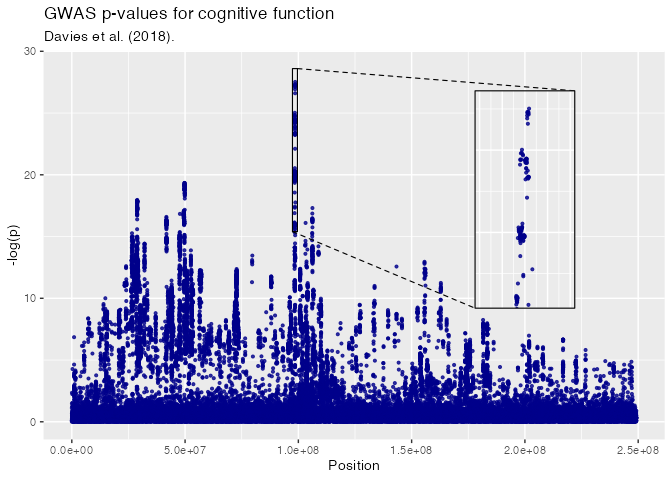

## Colours and lines

``` r

ggp + 
  geom_magnify(from = from, to = to,
               colour = "red", linewidth = 0.5, proj.linetype = 3)
```

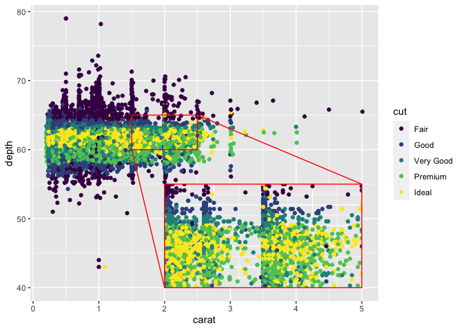

## Axes

``` r

ggp + 
  scale_x_continuous(labels = NULL) + 
  geom_magnify(from = from, to = to, 
               axes = "xy")
```

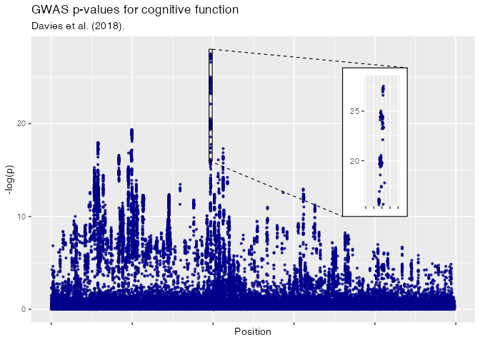

## Inset with shadow

``` r

loadNamespace("ggfx")
#> <environment: namespace:ggfx>

ggp + 
  geom_magnify(from = from, to = to, 
               shadow = TRUE)
```


## Ellipse

This requires R \>= 4.2.0 and an appropriate graphics device.

``` r

ggp + 
  geom_magnify(from = from, to = to, 
               shape = "ellipse", shadow = TRUE)
```


## Faceting (experimental)

Faceting involves dark magic with ggplot2 internals. Use at your own
risk.

``` r
iris$median_sw <- ave(iris$Sepal.Width, iris$Species, FUN = median)
iris$median_sl <- ave(iris$Sepal.Length, iris$Species, FUN = median)

ggpi <- ggplot(iris, aes(Sepal.Width, Sepal.Length, colour = Species)) +
              geom_point() + xlim(c(2, 6))

# geom_magnify_tile uses x, y, width and height
ggpi +
  facet_wrap(vars(Species)) +
  geom_magnify_tile(aes(x = median_sw, y = median_sl), 
                    width = 1, height = 1,
                    to_x = 5, to_y = 5, to_width = 1.5, to_height = 1.5,
                    shadow = TRUE)
```

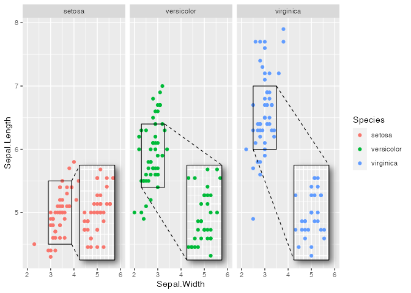

## Magnify an arbitrary region (experimental)

``` r

library(dplyr)
#> 
#> Attaching package: 'dplyr'
#> The following objects are masked from 'package:stats':
#> 
#>     filter, lag
#> The following objects are masked from 'package:base':
#> 
#>     intersect, setdiff, setequal, union

humans <- starwars |> 
  filter(species == "Human") |> 
  select(mass, height) |> 
  na.omit()
hhull <- hull_around(mass, height, data = humans, expand = 0.2)


ggplot(starwars, aes(mass, height, color = species == "Human")) + 
  geom_point() + xlim(0, 200) + ylim(0, 250) + 
  scale_colour_manual(values = c("TRUE" = "red", "FALSE" = "grey60")) + 
  geom_magnify(from = hhull, to = c(30, 0, 200, 120), shadow = TRUE,
               alpha = 0.8, colour = "darkgreen", linewidth = 0.6)
#> Warning: Removed 29 rows containing missing values (`geom_point()`).
```

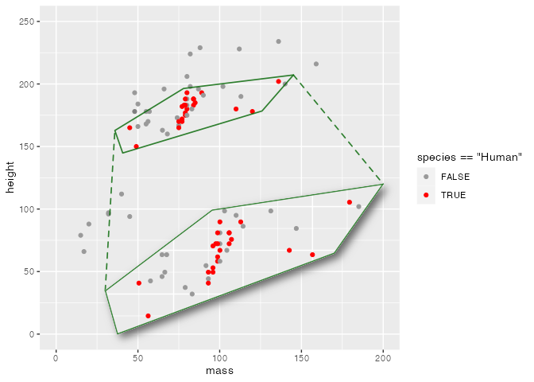

## Maps (experimental)

``` r

usa <- sf::st_as_sf(maps::map("state", fill=TRUE, plot =FALSE))

ggpm <- ggplot(usa) +
          geom_sf(aes(fill = ID == "texas"), colour = "grey20") +
          coord_sf(default_crs = sf::st_crs(4326), ylim = c(10, 50)) + 
          theme(legend.position = "none") +
          scale_fill_manual(values = c("TRUE" = "red", "FALSE" = "steelblue4"))
          

texas <- usa[usa$ID == "texas",]
texas <- sf::st_transform(texas, sf::st_crs(4326))
texas <- sf::st_as_grob(sf::st_as_sfc(texas))
ggpm + geom_magnify(from = texas,
                    to = c(-120, 10, -95, 30), 
                    shadow = TRUE, linewidth = 1, colour = "orange3",
                    aspect = "fixed")
```

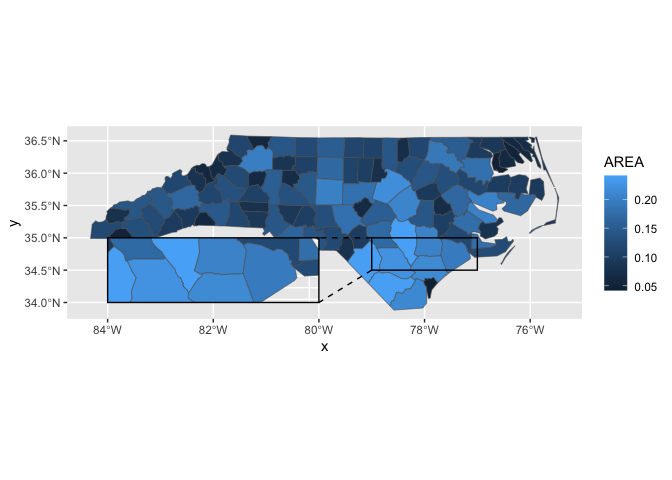

## Tips and tricks

### Adding layers to the inset

`geom_magnify()` stores the plot when it is added to it. So, order
matters:

``` r

ggpi <- ggplot(iris, aes(Sepal.Width, Sepal.Length, colour = Species)) +
              geom_point() + xlim(2, 6)
ggpi + 
  geom_smooth() + 
  geom_magnify(from = c(2.5, 6, 3.5, 7), to = c(4.7, 4.3, 6.1, 5.7))
#> `geom_smooth()` using method = 'loess' and formula = 'y ~ x'
#> `geom_smooth()` using method = 'loess' and formula = 'y ~ x'
```

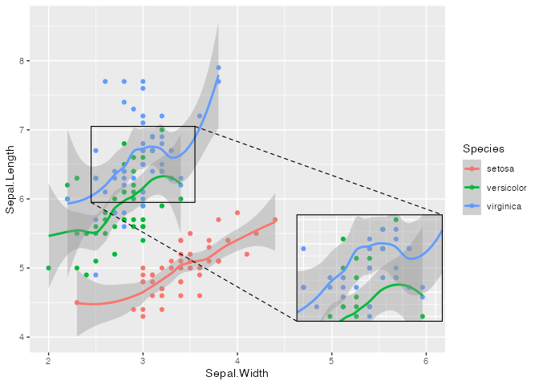

``` r
# Print the inset without the smooth:
ggpi +
  geom_magnify(from = c(2.5, 6, 3.5, 7), to = c(4.7, 4.3, 6.1, 5.7)) +
  geom_smooth()
#> `geom_smooth()` using method = 'loess' and formula = 'y ~ x'
```

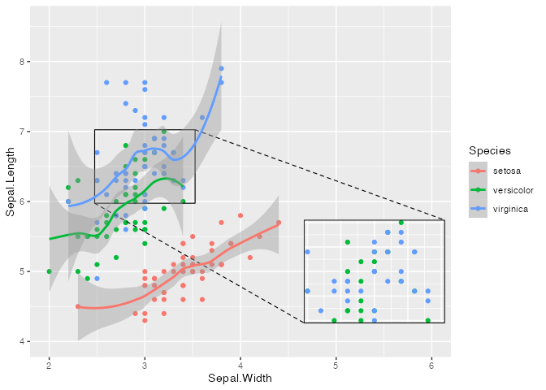

For complex modifications to the inset, set `plot` explicitly:

``` r

booms <- ggplot(faithfuld, aes(waiting, eruptions)) +
         geom_contour_filled(aes(z = density), bins = 50) +
         scale_fill_viridis_d(option = "B") + 
         theme(legend.position = "none")

booms_inset <- booms + 
  geom_point(data = faithful, color = "red", fill = "white", alpha = 0.7, 
             size = 2, shape = "circle filled") + 
  coord_cartesian(expand = FALSE)

shadow.args <- list(
  colour = alpha("grey80", 0.8),
  x_offset = 0,
  y_offset = 0,
  sigma = 10
)

booms + geom_magnify(from = c(78, 4.0, 90, 4.8), to = c(70, 1.7, 90, 3.3),
                     colour = "white", shape = "ellipse",
                     shadow = TRUE, shadow.args = shadow.args,
                     plot = booms_inset)
```

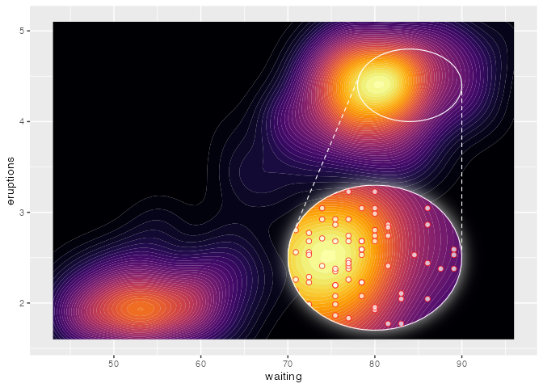

### Draw an inset outside the plot region

``` r

ggp + 
  coord_cartesian(clip = "off") + 
  theme(plot.margin = ggplot2::margin(10, 60, 10, 10)) +
  geom_magnify(from = from, to = to + c(0.5e8, 0, 0.5e8, 0), 
               shadow = TRUE)
```

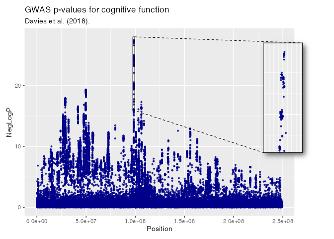

### Keep grid lines the same

To make sure the inset uses the same grid lines as the main graph, set
`breaks` in `scale_x` and `scale_y`:

``` r

ggp2 <- ggplot(iris, aes(Sepal.Width, Sepal.Length, color = Species)) + 
        geom_point() +
        theme_classic() + 
        theme(panel.grid.major = element_line("grey80"),
              panel.grid.minor = element_line("grey90"))

# different grid lines:
ggp2 + 
  geom_magnify(from = c(2.45, 5.9, 3.05, 6.6), to = c(3.4, 5.5 , 4.4, 6.6),
               shadow = TRUE) 
```

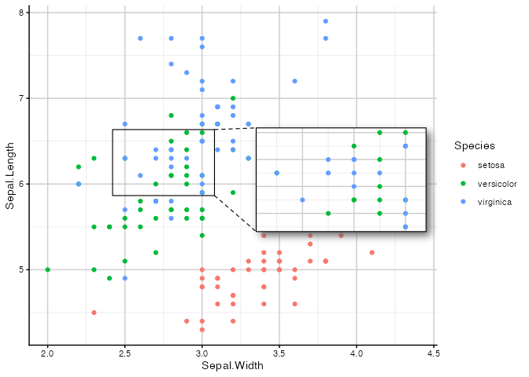

``` r

# fix the grid lines:
ggp2 +
  scale_x_continuous(breaks = seq(2, 5, 0.5)) + 
  scale_y_continuous(breaks = seq(5, 8, 0.5)) + 
  geom_magnify(from = c(2.45, 5.9, 3.05, 6.6), to = c(3.4, 5.5 , 4.4, 6.6),
               shadow = TRUE) 
```

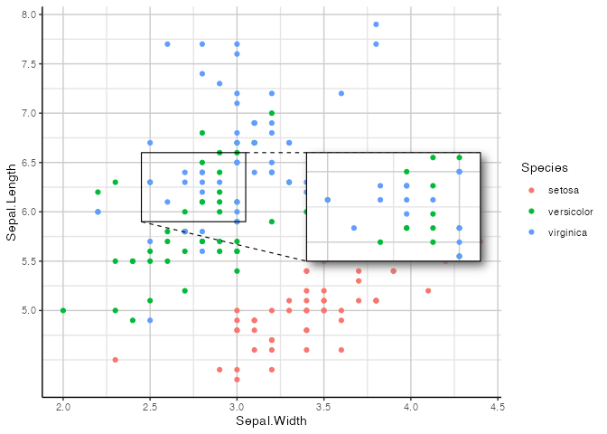

### Recomputing data

Use `recompute` if you want to recompute smoothers, densities, etc. in
the inset.

``` r
 
df <- data.frame(x = seq(-5, 5, length = 500), y = 0)
df$y[abs(df$x) < 1] <- sin(df$x[abs(df$x) < 1])
df$y <- df$y + rnorm(500, mean = 0, sd = 0.25)

ggp2 <- ggplot(df, aes(x, y)) + 
  geom_point() + 
  geom_smooth(method = "loess", formula = y ~ x) + 
  ylim(-5, 5)

# The default:
ggp2 + geom_magnify(from = c(-1.25, -1, 1.25, 1),
                    to = c(2, 1, 5, 5))
```

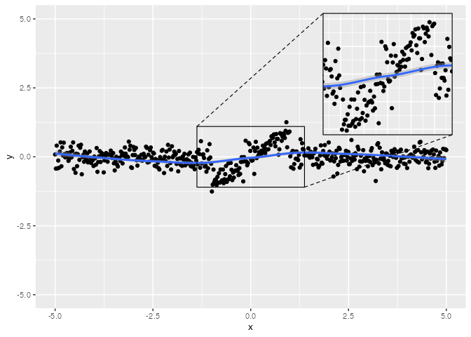

``` r

# Recomputing recalculates the smooth for the inset:
ggp2 + geom_magnify(from = c(-1.25, -1, 1.25, 1),
                    to = c(2, 1, 5, 5),
                    recompute = TRUE)
```

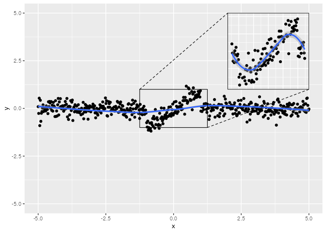

### Magnify within a magnify

``` r
ggplot(
  data.frame(x=runif(3000, 2,4.5),y= runif(3000, 4, 8)), 
  aes(x=x,y=y)) +
  coord_cartesian(expand = FALSE) +
  geom_density2d_filled(bins = 50, linewidth = 0) +
  geom_point(color='white', alpha = .5, size = .5) + 
  theme(legend.position = "none") +
  geom_magnify(from = c(2.1, 4.1, 2.4, 4.4), to = c(2.5, 4.5, 3.4, 5.4), 
               colour = "white", proj.linetype = 1, linewidth = 0.6) +
  geom_magnify(from = c(2.8, 4.8, 3.1, 5.1), to = c(3,5.5,4.4,6.9), 
               expand = FALSE, colour ="white", proj.linetype = 1, 
               linewidth = 0.6)
```

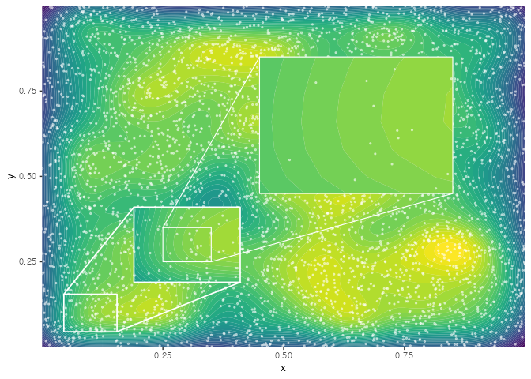

An inset *within* an inset is a bit more complex, but also doable:

``` r

ggp <- data.frame(x = rnorm(1e5), y = rnorm(1e5), 
                  colour = sample(8L, 1e5, replace = TRUE)) |> 
  ggplot(aes(x = x, y = y, colour = factor(colour))) + 
  scale_color_brewer(type = "qual", palette = 2) +
  geom_point(alpha = 0.12, size = 0.7) + 
  lims(x = c(-3,3), y = c(-3,3)) +
  theme_classic() + theme(panel.grid = element_blank(), 
                          axis.line = element_blank(), 
                          plot.background = element_rect(fill = "black"),
                          panel.background = element_rect(fill = "black"),
                          legend.position = "none")

ggpm <- ggp + 
  lims(x = c(-0.3, 0.3), y = c(-0.3, 0.3)) + 
  geom_magnify(from = c(-0.03, -0.03, 0.03, 0.03),
               to = c(-0.3, -0.3, -0.1, -0.1),
               expand = FALSE, colour = "white")
#> Scale for x is already present.
#> Adding another scale for x, which will replace the existing scale.
#> Scale for y is already present.
#> Adding another scale for y, which will replace the existing scale.

ggp + 
  geom_magnify(plot = ggpm, 
               from = c(-0.3, -0.3, 0.3, 0.3),
               to = c(-3, -3, -1, -1),
               expand = FALSE, colour = "white") +
  labs(title = "Normal data", 
       subtitle = "The distribution gets more uniform as you zoom in")
#> Warning: Removed 566 rows containing missing values (`geom_point()`).
```

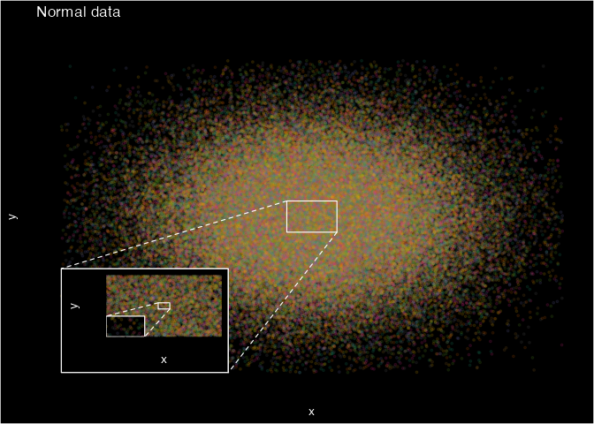

## Acknowledgements

ggmagnify was inspired by [this
post](https://stackoverflow.com/a/66409862/10522567) and motivated by
making [these plots](https://github.com/hughjonesd/academic-bias).

Data for the GWAS plots comes from:

Davies et al. (2018) ‘Study of 300,486 individuals identifies 148
independent genetic loci influencing general cognitive function.’
*Nature Communications*.

Data was trimmed to remove overlapping points.
