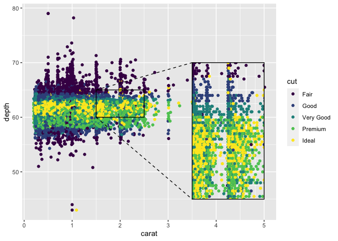

<!-- README.md is generated from README.Rmd. Please edit that file -->

# ggmagnify

<!-- badges: start -->

[](https://github.com/hughjonesd/ggmagnify/actions/workflows/R-CMD-check.yaml)
<!-- badges: end -->

ggmagnify creates a magnified inset of part of a
[ggplot](https://ggplot2.tidyverse.org/) object. Borders can be drawn
around the target area and the inset, along with projection lines from
one to the other. If the `ggfx` package is installed, the inset can have
a drop shadow.

You can install the development version of ggmagnify from
[GitHub](https://github.com/) with:

``` r
# install.packages("remotes")
remotes::install_github("hughjonesd/ggmagnify")
```

## Basic inset

``` r
library(ggplot2)
library(ggmagnify)

ggp <- ggplot(diamonds, aes(carat, depth, color = cut)) + geom_point()

ggmagnify(ggp,
          xlim = c(1.5, 2.5), ylim = c(60, 65),
          inset_xlim = c(2, 5), inset_ylim = c(40, 55))
```


## Positioning

``` r

ggmagnify(ggp,
          xlim = c(1.5, 2.5), ylim = c(60, 65),
          inset_xlim = c(3.5, 5), inset_ylim = c(45, 70))
```



## Inset with shadow

``` r

library(ggfx)

ggmagnify(ggp,
          xlim = c(1.5, 2.5), ylim = c(60, 65),
          inset_xlim = c(2, 5), inset_ylim = c(40, 55), shadow = TRUE)
```


## Colours and lines

``` r

ggmagnify(ggp,
          xlim = c(1.5, 2.5), ylim = c(60, 65),
          inset_xlim = c(2, 5), inset_ylim = c(40, 55), 
          proj = "single",
          colour = "grey20", proj_linetype = 1, linewidth = 0.8)
```


## Axes

``` r

ggmagnify(ggp,
          xlim = c(1.5, 2.5), ylim = c(60, 65),
          inset_xlim = c(2, 5), inset_ylim = c(40, 55), 
          axes = TRUE, border = FALSE)
```


## Inset outside the plot region

``` r

ggp_noclip <- ggp + 
              coord_cartesian(xlim = c(0, 5), ylim = c(40, 80), clip = "off") +
              theme(legend.justification = c(0, 1))

ggmagnify(ggp_noclip,
          xlim = c(1.5, 2.5), ylim = c(60, 65),
          inset_xlim = c(2.6, 6), inset_ylim = c(40, 55),
          shadow = TRUE)
```


## Maps (experimental)

I mean, it’s all experimental, but maps are *really* experimental.

``` r

library(sf)
#> Linking to GEOS 3.11.0, GDAL 3.5.3, PROJ 9.1.0; sf_use_s2() is TRUE

nc <- sf::st_read(system.file("shape/nc.shp", package = "sf"), quiet = TRUE)
ggp <- ggplot(nc) + geom_sf(aes(fill = AREA)) +
       coord_sf(default_crs = sf::st_crs(4326))

xlim <- c(-79, -77)
ylim <- c(34.5, 35)

ggmagnify(ggp, xlim = xlim, ylim = ylim,
          inset_xlim = c(-84, -80), inset_ylim = c(34.25, 35.25),
          inset_coord = coord_sf(default_crs = sf::st_crs(4326),
                                  xlim = xlim, ylim = ylim), 
          shadow = TRUE)
```


## Advanced usage: tweaking the inset

``` r
# Advanced usage

library(ggplot2)

booms <- ggplot(faithfuld, aes(waiting, eruptions)) +
         geom_contour_filled(aes(z = density)) +
         scale_fill_viridis_d(option = "B")

shadow_args <- list(
  colour = alpha("grey80", 0.8),
  x_offset = 0,
  y_offset = 0,
  sigma = 10
)

ggm <- ggmagnify(booms,
                 xlim = c(80, 92), ylim = c(4, 4.8),
                 inset_xlim = c(70, 94), inset_ylim = c(1.7, 3.3),
                 shadow = TRUE, shadow_args = shadow_args,
                 compose = FALSE, colour = "white")

# modify the inset like a ggplot object:
ggm$inset <- ggm$inset +
             geom_point(data = faithful, color = "red", fill = "white", alpha = 0.7,
                        size = 2, shape = "circle filled")


compose(ggm, booms)
```


