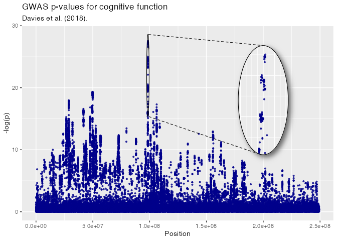
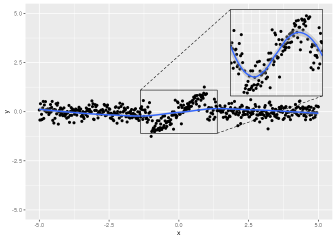

<!-- README.md is generated from README.Rmd. Please edit that file -->

# ggmagnify

<!-- badges: start -->

[](https://github.com/hughjonesd/ggmagnify/actions/workflows/R-CMD-check.yaml)
[](https://lifecycle.r-lib.org/articles/stages.html#experimental)
<!-- badges: end -->

ggmagnify creates a magnified inset of part of a
[ggplot](https://ggplot2.tidyverse.org/) object. Borders can be drawn
around the target area and the inset, along with projection lines from
one to the other. The inset can have a drop shadow. The magnified area
can be a rectangle or an ellipse.

You can install the development version of ggmagnify from
[GitHub](https://github.com/) with:

``` r
# install.packages("remotes")
remotes::install_github("hughjonesd/ggmagnify")
```

## Basic inset

``` r
library(ggplot2)
library(ggmagnify)

ggp <- ggplot(dv, aes(Position, NegLogP, color = cut)) + 
  geom_point(color = "darkblue", alpha = 0.8, size = 0.8) +
  labs(title = "GWAS p-values for cognitive function",
       subtitle = "Davies et al. (2018).")


ggp + 
  geom_magnify(x = 98500000, width = 2e6, y = 22, height = 12,
               to_x = 2e08, to_y = 18, magnify = c(20, 1.5))
```


## Colours and lines

``` r

x <- 98500000
width <- 2e6
y <- 22
height <- 12
to_x <- 2.2e08
to_y <- 18
magnify <- c(20, 1.5)

ggp + 
  geom_magnify(x = x, width = width, y = y, height = height,
               to_x = to_x, to_y = to_y, magnify = magnify,
               colour = "red", linewidth = 0.5, proj.linetype = 3)
```


## Axes

``` r

ggp + 
  scale_x_continuous(labels = NULL) + 
  geom_magnify(x = x, width = width, y = y, height = height,
               to_x = to_x, to_y = to_y, magnify = c(20, 1.5),
               axes = TRUE)
```


## Inset with shadow

``` r

loadNamespace("ggfx")
#> <environment: namespace:ggfx>

ggp + 
  geom_magnify(x = x, width = width, y = y, height = height,
               to_x = to_x, to_y = to_y, magnify = magnify,
               shadow = TRUE)
```


## Ellipse

This requires R \>= 4.2.0 and an appropriate graphics device.

``` r

loadNamespace("ggforce")
#> <environment: namespace:ggforce>

ggp + 
  geom_magnify(x = x, width = width, y = y, height = height,
               to_x = to_x, to_y = to_y, magnify = magnify,
               shape = "ellipse", shadow = TRUE)
```



## Inset outside the plot region

``` r

ggp + 
  coord_cartesian(clip = "off") + 
  theme(plot.margin = ggplot2::margin(10, 60, 10, 10)) +
  geom_magnify(x = x, width = width, y = y, height = height,
               to_x = 2.5e08, to_y = to_y, magnify = c(20, 1.5),
               shadow = TRUE)
```


## Faceting (experimental)

Faceting involves dark magic with ggplot2 internals. Use at your own
risk\!

``` r
iris$median_sw <- ave(iris$Sepal.Width, iris$Species, FUN = median)
iris$median_sl <- ave(iris$Sepal.Length, iris$Species, FUN = median)

ggpi <- ggplot(iris, aes(Sepal.Width, Sepal.Length, colour = Species)) +
              geom_point() + xlim(c(2, 6))


ggpi +
  facet_wrap(vars(Species)) +
  geom_magnify(aes(x = median_sw, y = median_sl), 
               width = 1, height = 1,
               to_x = 5, to_y = 5, magnify = 1.5, shadow = TRUE)
```


## Maps (experimental)

Not yet.

## Tips: adding layers to the inset

`geom_magnify()` stores the plot when it is added to it. So, order
matters:

``` r

ggpi <- ggplot(iris, aes(Sepal.Width, Sepal.Length, colour = Species)) +
              geom_point() + xlim(2, 6)
ggpi + 
  geom_smooth() + 
  geom_magnify(x = 3, width = 1, y = 6.5, height = 1,
                  to_x = 5.4, to_y = 5, magnify = 1.4)
#> `geom_smooth()` using method = 'loess' and formula = 'y ~ x'
#> `geom_smooth()` using method = 'loess' and formula = 'y ~ x'
#> `geom_smooth()` using method = 'loess' and formula = 'y ~ x'
```


``` r

# Print the inset without the smooth:
ggpi +
  geom_magnify(x = 3, width = 1, y = 6.5, height = 1,
               to_x = 5.4, to_y = 5, magnify = 1.4) + 
  geom_smooth()
#> `geom_smooth()` using method = 'loess' and formula = 'y ~ x'
```


For complex modifications to the inset, set `plot` explicitly:

``` r

booms <- ggplot(faithfuld, aes(waiting, eruptions)) +
         geom_contour_filled(aes(z = density)) +
         scale_fill_viridis_d(option = "B")

booms_inset <- booms + 
  geom_point(data = faithful, color = "red", fill = "white", alpha = 0.7, 
             size = 2, shape = "circle filled") + 
  coord_cartesian(expand = FALSE)

shadow.args <- list(
  colour = alpha("grey80", 0.8),
  x_offset = 0,
  y_offset = 0,
  sigma = 10
)

booms + geom_magnify(x = 84, width = 10, y = 4.4, height = .8,
                     to_x = 80, to_y = 2.5, magnify = 2,
                     colour = "white", shape = "ellipse",
                     shadow = TRUE, shadow.args = shadow.args,
                     plot = booms_inset)
```


## Tips: keeping grid lines the same

To make sure the inset uses the same grid lines as the main graph, set
`breaks` in `scale_x` and `scale_y`:

``` r

ggp2 <- ggplot(iris, aes(Sepal.Width, Sepal.Length, color = Species)) + 
        geom_point() +
        theme_classic() + 
        theme(panel.grid.major = element_line("grey80"),
              panel.grid.minor = element_line("grey90"))

# different grid lines:
ggp2 + 
  geom_magnify(x = 2.75, width = 0.6, y = 6.25, height = 0.6,
               to_x = 3.8, to_y = 5.5, magnify = 1.8, shadow = TRUE) 
```


``` r

# fix the grid lines:
ggp2 +
  scale_x_continuous(breaks = seq(2, 5, 0.5)) + 
  scale_y_continuous(breaks = seq(5, 8)) + 
  geom_magnify(x = 2.75, width = 0.6, y = 6.25, height = 0.6,
               to_x = 3.8, to_y = 5.5, magnify = 1.8, shadow = TRUE) 
```


## Tips: recomputing data

``` r
 # Recomputing
df <- data.frame(x = seq(-5, 5, length = 500), y = 0)
df$y[abs(df$x) < 1] <- sin(df$x[abs(df$x) < 1])
df$y <- df$y + rnorm(500, mean = 0, sd = 0.25)

ggp2 <- ggplot(df, aes(x, y)) + 
  geom_point() + 
  geom_smooth(method = "loess", formula = y ~ x) + 
  ylim(-5, 5)

# The default:
ggp2 + geom_magnify(x = 0, width = 2.5, y = 0, height = 2,
                    to_x = 3, to_y = 3, magnify = 1.8)
```


``` r

# Recomputing recalculates the smooth for the inset
ggp2 + geom_magnify(x = 0, width = 2.5, y = 0, height = 2,
                    to_x = 3, to_y = 3, magnify = 1.8, recompute = TRUE)
#> Warning: Removed 381 rows containing non-finite values (`stat_smooth()`).
#> Warning: Removed 381 rows containing missing values (`geom_point()`).
```



## Source

Davies et al. (2018) ‘Study of 300,486 individuals identifies 148
independent genetic loci influencing general cognitive function.’ Nature
Communications

Data was trimmed to remove overlapping points.
