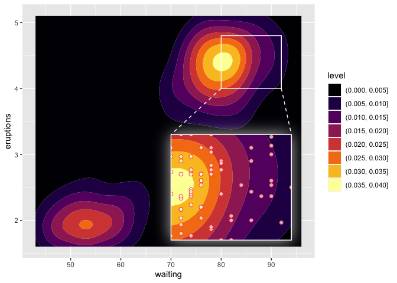

<!-- README.md is generated from README.Rmd. Please edit that file -->

# ggmagnify

<!-- badges: start -->
<!-- badges: end -->

ggmagnify creates a magnified inset of part of a
[ggplot](https://ggplot2.tidyverse.org/) object. Borders can be drawn
around the target area and the inset, along with projection lines from
one to the other. If the `ggfx` package is installed, the inset can have
a drop shadow.

You can install the development version of ggmagnify from
[GitHub](https://github.com/) with:

``` r
# install.packages("remotes")
remotes::install_github("hughjonesd/ggmagnify")
```

## Basic inset

``` r
library(ggplot2)
library(ggmagnify)

ggp <- ggplot(diamonds, aes(carat, depth, color = cut)) + geom_point()

ggmagnify(ggp,
          xlim = c(1.5, 2.5), ylim = c(60, 65),
          inset_xlim = c(2, 5), inset_ylim = c(40, 55))
```


## Inset with shadow

``` r

requireNamespace("ggfx", quietly = TRUE)

ggmagnify(ggp,
          xlim = c(1.5, 2.5), ylim = c(60, 65),
          inset_xlim = c(2, 5), inset_ylim = c(40, 55), shadow = TRUE)
```


## Colours and lines

``` r

ggmagnify(ggp,
          xlim = c(1.5, 2.5), ylim = c(60, 65),
          inset_xlim = c(2, 5), inset_ylim = c(40, 55), 
          colour = "red", proj_linetype = 1)
```


## Axes

``` r

ggmagnify(ggp,
          xlim = c(1.5, 2.5), ylim = c(60, 65),
          inset_xlim = c(2, 5), inset_ylim = c(40, 55), 
          axes = TRUE, border = FALSE)
```


## Advanced usage: tweaking the inset

``` r
ggm <- ggmagnify(ggp, xlim = c(1.5, 2.5), ylim = c(60, 65),
           inset_xlim = c(2, 5), inset_ylim = c(40, 55), 
           compose = FALSE) 

# modify the inset like a ggplot object:
ggm$inset <- ggm$inset + 
               theme_classic() + 
               inset_theme(axes = TRUE) + 
               theme(plot.margin = margin(10, 12, 10, 10))

compose(ggm, ggp)
```


