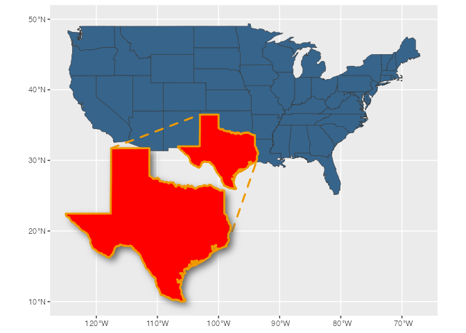
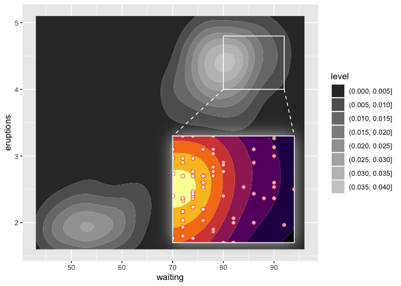
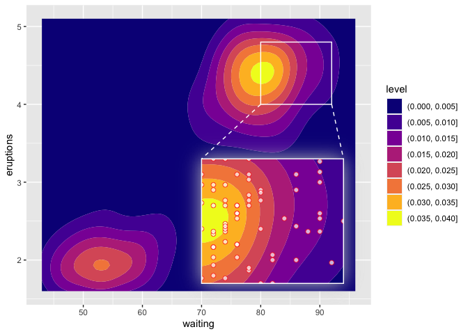
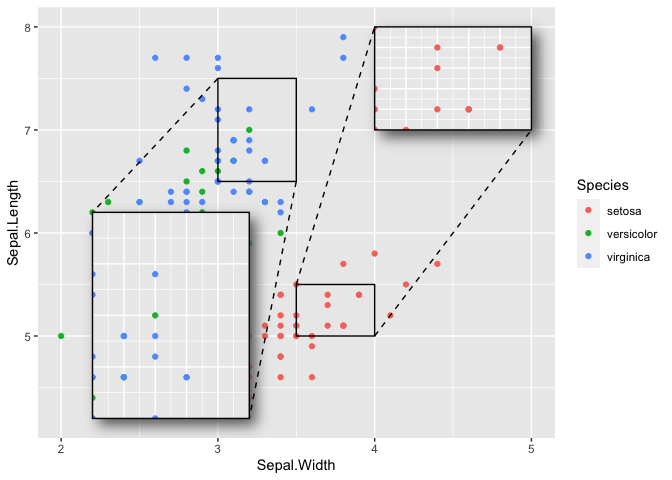

<!-- README.md is generated from README.Rmd. Please edit that file -->

# ggmagnify

<!-- badges: start -->

[](https://github.com/hughjonesd/ggmagnify/actions/workflows/R-CMD-check.yaml)
[](https://lifecycle.r-lib.org/articles/stages.html#experimental)
<!-- badges: end -->

ggmagnify creates a magnified inset of part of a
[ggplot](https://ggplot2.tidyverse.org/) object. Borders can be drawn
around the target area and the inset, along with projection lines from
one to the other. If the `ggfx` package is installed, the inset can have
a drop shadow.

You can install the development version of ggmagnify from
[GitHub](https://github.com/) with:

``` r
# install.packages("remotes")
remotes::install_github("hughjonesd/ggmagnify")
```

## Basic inset

``` r
library(ggplot2)
library(ggmagnify)

ggp <- ggplot(diamonds, aes(carat, depth, color = cut)) + geom_point()

ggmagnify(ggp,
          xlim = c(1.5, 2.5), ylim = c(60, 65),
          inset_xlim = c(2, 5), inset_ylim = c(40, 55))
```


## Positioning

``` r

ggmagnify(ggp,
          xlim = c(1.5, 2.5), ylim = c(60, 65),
          inset_xlim = c(3.5, 5), inset_ylim = c(45, 70))
```


## Colours and lines

``` r

ggmagnify(ggp,
          xlim = c(1.5, 2.5), ylim = c(60, 65),
          inset_xlim = c(2, 5), inset_ylim = c(40, 55), 
          proj = "single",
          colour = "red", proj_linetype = 1, linewidth = 0.8)
```


## Axes

``` r

ggmagnify(ggp,
          xlim = c(1.5, 2.5), ylim = c(60, 65),
          inset_xlim = c(2, 5), inset_ylim = c(40, 55), 
          axes = TRUE, border = FALSE)
```


## Inset with shadow

``` r

library(ggfx)

ggmagnify(ggp,
          xlim = c(1.5, 2.5), ylim = c(60, 65),
          inset_xlim = c(2, 5), inset_ylim = c(40, 55), shadow = TRUE)
```


## Inset outside the plot region

``` r

ggp_noclip <- ggp + 
              coord_cartesian(xlim = c(0, 5), ylim = c(40, 80), clip = "off") +
              theme(legend.justification = c(0, 1))

ggmagnify(ggp_noclip,
          xlim = c(1.5, 2.5), ylim = c(60, 65),
          inset_xlim = c(2.6, 6), inset_ylim = c(40, 55),
          shadow = TRUE)
```


## Maps (experimental)

I mean, it’s all experimental, but maps are *really* experimental.

``` r
# Using maps
#
if (requireNamespace("sf", quietly = TRUE)) {
  nc <- sf::st_read(system.file("shape/nc.shp", package = "sf"), quiet = TRUE)

  ggp <- ggplot(nc) +
    geom_sf(aes(fill = AREA)) +
    coord_sf(default_crs = sf::st_crs(4326))

  xlim <- c(-79, -77)
  ylim <- c(34.5, 35)

  # Specify xlim and ylim, but also manually specify the coordinate
  # system for the inset:
  ggmagnify(ggp, xlim = xlim, ylim = ylim,
            inset_xlim = c(-84, -80), inset_ylim = c(34, 35),
            inset_coord = coord_sf(default_crs = sf::st_crs(4326),
                                    xlim = xlim, ylim = ylim))

}
```



## Advanced usage: adding layers to the inset, original plot, or both

``` r
# Advanced usage

library(ggplot2)

booms <- ggplot(faithfuld, aes(waiting, eruptions)) +
         geom_contour_filled(aes(z = density)) +
         scale_fill_viridis_d(option = "B")

shadow_args <- list(
  colour = alpha("grey80", 0.8),
  x_offset = 0,
  y_offset = 0,
  sigma = 10
)

ggm <- ggmagnify(booms,
                 xlim = c(80, 92), ylim = c(4, 4.8),
                 inset_xlim = c(70, 94), inset_ylim = c(1.7, 3.3),
                 shadow = TRUE, shadow_args = shadow_args,
                 colour = "white")

# modify the inset only:
ggm$inset <- ggm$inset +
             geom_point(data = faithful, color = "red", fill = "white",
                        alpha = 0.7, size = 2, shape = "circle filled")

ggm
```


``` r

# modify the original plot only:

ggm$plot <- ggm$plot + scale_fill_grey()
#> Scale for fill is already present.
#> Adding another scale for fill, which will replace the existing scale.

ggm
```



``` r

# modify both. NB: this only works with the latest R:

if (getRversion() >= "4.3.0") {
  ggm + scale_fill_viridis_d(option = "C")
}
#> Scale for fill is already present.
#> Adding another scale for fill, which will replace the existing scale.
#> Scale for fill is already present.
#> Adding another scale for fill, which will replace the existing scale.
```



## Advanced usage: multiple insets

Use compose to add multiple GgMagnify objects to the original plot in
turn:

``` r
ggp <- ggplot(iris, aes(Sepal.Width, Sepal.Length, color = Species)) + 
       geom_point()

ggm1 <- ggmagnify(ggp, 
                  xlim = c(3.5, 4), ylim = c(5, 5.5),
                  inset_xlim = c(4, 5), inset_ylim = c(7, 8),
                  shadow = TRUE) 

ggm2 <- ggmagnify(ggp, 
                  xlim = c(3, 3.5), ylim = c(6.5, 7.5),
                  inset_xlim = c(2.2, 3.2), inset_ylim = c(4.2, 6.2),
                  shadow = TRUE)

ggp <- compose( ggm1, ggp)
ggp <- compose( ggm2, ggp)
ggp
```


